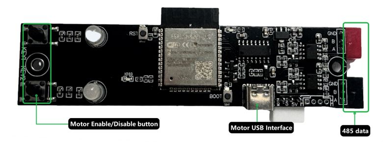

# Peopoly Magneto X Linear Motor Control Board Firmware



This controls two Motion G 2x MotionG "DN1-G60xxN" boards.
Each board is on its own interface, and both boards have a Modbus address of 1.

# Original Documentation
按键功能:

Disable: 失能两个电机
Enable: 清除错误，和重新使能两个电机

LED灯效:

X轴: 当有错误时，灯是红色，正常时，灯是绿色
Y轴: 当有错误时，灯是红色，正常时，灯是绿色

# Hardware Information
System On Chip: ESP32-WROOM-32D

## Buttons and Interfaces
* Disable Button
* Enable Button
* X Motor Status Red/Green LED
* Y Motor Status Red/Green LED
* USB-C Connector
* JST USB Connector. Shares pins with USB-C Connector
* X Motor RS485 Connector
* Y Motor RS485 Connector
* 3 pin JST Connector to BTT Octopus Pro Board

# Common Linear Motor Error Codes
| error code |                                                       reason                                                      |                                                     how to solve                                                     |
|:----------:|:-----------------------------------------------------------------------------------------------------------------:|:--------------------------------------------------------------------------------------------------------------------:|
| 0x33,0x31  | There is poor contact or disconnection in the power lines U, V, and W of the motor.                               | Check whether the motor power cable is properly connected                                                            |
| 0x32,0x30  | The power supply voltage of the driver is insufficient and below the minimum value of the hardware voltage input. | enable motor again                                                                                                   |
| 0xFF,0x07  | Hardware overcurrent caused an error in the DRV nFault pin.                                                       | Check whether the power output line of the motor is short-circuited between phases, or short-circuited to the ground |
| 0x84,0x00  | The protection is activated when the maximum velocity limit switch is turned on.                                  | reduce speed                                                                                                         |
| 0x86,0x11  | position control error exceeds the tracking error window                                                          | Check whether cable connections are correct 2.Ensure that the motor power is appropriate                             |

# External Documentation
* [ESP32-WROOM-32D](https://www.espressif.com/sites/default/files/documentation/esp32-wroom-32d_esp32-wroom-32u_datasheet_en.pdf)
* [ESP32 Datasheet](https://www.espressif.com/sites/default/files/documentation/esp32_datasheet_en.pdf)
* [MODBUS APPLICATION PROTOCOL SPECIFICATION](https://modbus.org/docs/Modbus_Application_Protocol_V1_1b3.pdf)

## Peopoly
* [Overview of the Magneto X Electronic Hardware System](https://wiki.peopoly.net/en/magneto/magneto-x/magneto-x-electronic-system)
* [Guide to Capturing Linear Motor Error Codes](https://wiki.peopoly.net/en/magneto/magneto-x/get-error-code-in-touchscreen)
* [Linear Motor Parameters](https://wiki.peopoly.net/en/magneto/magneto-x/parameters-introduce)
* [LinearMotorHost User Guide](https://wiki.peopoly.net/en/magneto/magneto-x/linearmotorhost-user-guide)

## Motion G
* [Hardware User Manual -> DN1-G60xxN  General Control Mode User Manual](https://motiong.feishu.cn/wiki/BSI8w4HKSi02MmkHoTScPmh1nub)
* [Software User Manual -> DN1-G60xxN  General Control Mode Software Guidance](https://motiong.feishu.cn/wiki/R4E0wo3eFigeNsk3YeYcp9C7nkh)
* [Software User Manual -> Upper computer debugging software user manua](https://motiong.feishu.cn/wiki/UKA9wAqvIiimYokaIEFctnPgntf)

# Serial Communication
The device operates using a CH340 USB to Serial adapter.

115200 baud 8N1

## Connection Examples
* `pio device monitor`
* `python -m serial -e /dev/ttyUSB0 115200`

# Modes
The controller operates in one of two modes. Normal mode and RTU gateway mode.

# ASCII Mode
This automatically polls motor status, updating LEDs and the error pin as appropriate.
The buttons enable and disable the motors.  Enabling the motors also clears any ongoing errors.

In addition, error messages are reported via serial, and certain ACSII commands are availabe.

### Physical Details
|   Component  |                      Use                     |
|:------------:|:--------------------------------------------:|
| Left LED     | X Motor Status                               |
| Right LED    | Y Motor Status                               |
| Left Button  | Disable Motors (hold 1 second)               |
| Right Button | Enable Motors / Clear Errors (hold 1 second) |

## RTU Gateway Mode
The controller can be reconfigured as a Modbus gateway.
Enter this mode by sending 'RTU\n' when in normal mode.

### Details
**Device Ids**

| Id |   Device   |
|:--:|:----------:|
| 1  | Controller |
| 2  | X Motor    |
| 3  | Y Motor    |

**Discrete Inputs**

| Address |      Name      |
|:-------:|:--------------:|
| 1       | Disable Button |
| 2       | Enable Button  |

**Holding Registers**

| Address | Name | Values | Description                       |
|:-------:|:----:|--------|-----------------------------------|
| 1       | mode | 0-1    | 0: ASCII Mode 1: RTU GATEWAY Mode |
| 2       | XLed | 0-2    | 0: OFF 1: RED 2: GREEN            |
| 3       | YLed | 0-2    | 0: OFF 1: RED 2: GREEN            |

### Example
```shell
# Enter RTU Gateway Mode
stty -F /dev/ttyUSB0 cs8 -parenb -cstopb 115200
echo -e "RTU_GATEWAY\n" > /dev/ttyUSB0
cat /dev/ttyUSB0 > /dev/null
# Read Button State
mbpoll -a 1 -t1 -r 1 -c 2 /dev/ttyUSB0 -m rtu -b 115200 -P none -v -1
# Read LED State
mbpoll -a 1 -t4:hex -r 2 -c 2 /dev/ttyUSB0 -m rtu -b 115200 -P none -v -1
# Set LED Colors to green
mbpoll -a 1 -t4:hex -r 2 /dev/ttyUSB0 -m rtu -b 115200 -P none -v -- 2 2
# Exit RTU Mode
mbpoll -a 1 -t4:hex -r 1 /dev/ttyUSB0 -m rtu -b 115200 -P none -v -- 0
```
j